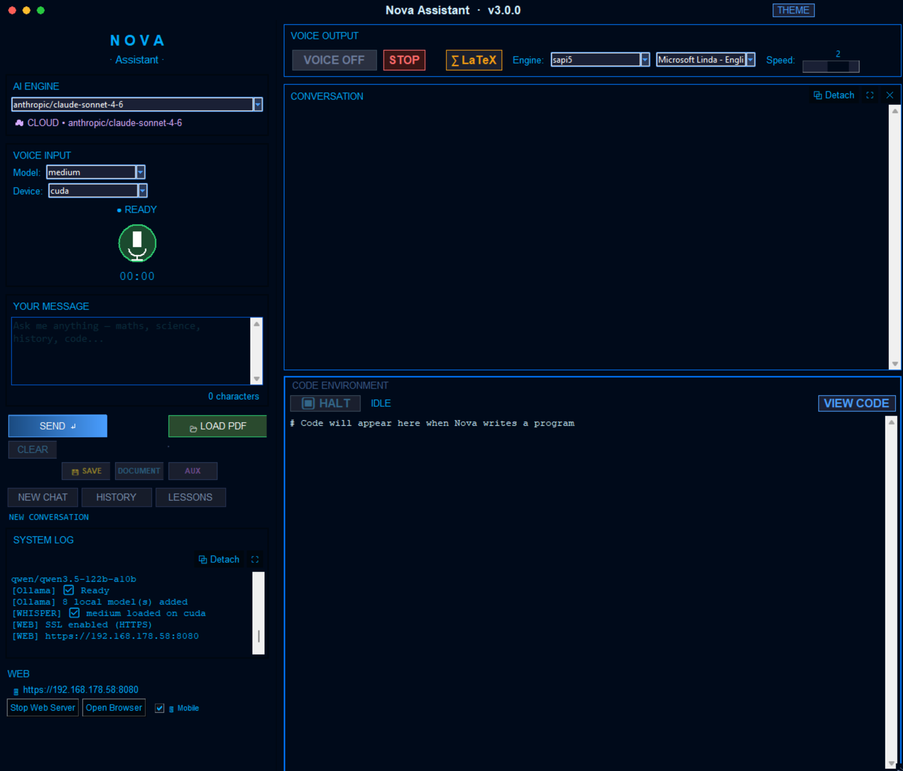
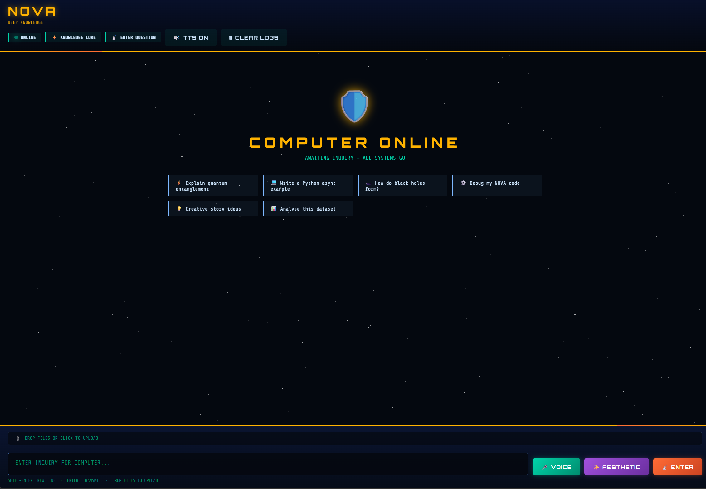
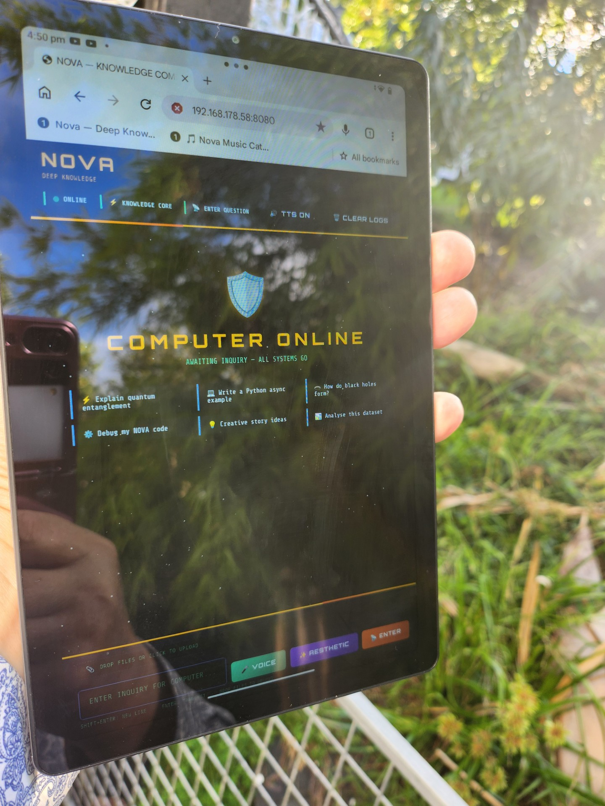

# 🚀 Nova Assistant

**Author:** Dr Tom Moir
**Version:** 2.0.0
**License:** MIT

Nova Assistant is an **AI-powered multimodal desktop system** that combines large language models, autonomous agents, tool execution, code generation, and real-time interaction into a unified environment.

It functions as:

> 🧠 **AI Operating System for Research, Coding, and Autonomous Tasks**

---

# ✨ Core Philosophy

Nova is built around a **single controlled execution pipeline**:

* No fragmented routing
* No competing tool triggers
* No hardcoded decision trees

Instead:

> ✅ **Supervisor → Execution Mode → Managed Execution → Final Synthesis**

---

# 🖥 Interfaces

Nova provides two fully integrated interfaces — a native desktop GUI and a browser-based web interface — both driven by the same AI engine.

## Desktop Interface (Tkinter)



The native desktop application runs locally on Windows and provides the full Nova experience including voice input, code execution, diagram rendering, and the complete tool suite.

## Web Interface — NOVA DEEP KNOWLEDGE



Nova includes a built-in web server that exposes a polished browser-based chat interface — the **Deep Knowledge Observatory**. It supports full markdown rendering, LaTeX mathematics (via MathJax), animated syntax highlighting, image and diagram display, voice input, and web-based TTS. It works on any device on your local network including phones and tablets, served over **HTTPS** for full audio and microphone support.

---
## Web Interface — Tablet Version or phone




---

# 🌐 Web Interface

## HTTPS and SSL Certificates

Nova's web interface runs over **HTTPS** by default. This is required for microphone access and audio playback in modern browsers — HTTP connections block these features on most devices.

Nova looks for `cert.pem` and `key.pem` in its root directory. If found, it enables HTTPS automatically. If not found, it falls back to plain HTTP (with reduced browser capability).

### Generating Self-Signed Certificates

Run this once in your Nova project directory:

```bash
openssl req -x509 -newkey rsa:4096 -keyout key.pem -out cert.pem -days 365 -nodes -subj "/CN=nova-local"
```

If you don't have OpenSSL installed, it is available via:
- **Git for Windows** (included in Git Bash)
- **Windows Subsystem for Linux**
- Direct download from [slproweb.com](https://slproweb.com/products/Win32OpenSSL.html)

After generating the certificates, restart Nova — the log will confirm:

```
[WEB] SSL enabled (HTTPS)
[WEB] Server at https://192.168.x.x:8080
```

### Trusting the Certificate on Remote Devices

Because the certificate is self-signed, browsers will show a security warning on first visit. This is expected and safe on your local network.

**On desktop Chrome/Edge:**
1. Navigate to `https://192.168.x.x:8080`
2. Click **Advanced** → **Proceed to site**

**On Android tablet/phone:**
1. Navigate to `https://192.168.x.x:8080`
2. Tap **Advanced** → **Proceed**
3. The warning only appears once — subsequent visits load directly

**On iPad/iPhone:**
1. Navigate to `https://192.168.x.x:8080`
2. Tap **Show Details** → **visit this website**
3. You may need to go to **Settings → General → About → Certificate Trust Settings** and enable full trust for the certificate

Once accepted, the interface loads fully with all features enabled.

---

## Starting the Web Server

In the desktop application, locate the **WEB** panel in the left sidebar:

1. Tick **📱 Mobile** to expose Nova to other devices on your network (phone, tablet)
2. Click **Start Web Server**
3. The status indicator updates to show the server address:
   - Local only: `https://127.0.0.1:8080`
   - Mobile/network mode: `https://192.168.x.x:8080`
4. Click **Open Browser** to launch the interface, or navigate to the address from any device on your network

## Stopping the Server

Click **Stop Web Server** in the same panel. The server shuts down immediately.

## Accessing from a Tablet or Phone

1. Make sure **📱 Mobile** is ticked before starting the server
2. Ensure your tablet/phone is on the **same Wi-Fi network** as your PC
3. Find your PC's local IP address — it is displayed in the Nova log when the server starts, e.g. `https://192.168.178.58:8080`
4. Type that address into the browser on your tablet
5. Accept the certificate warning (first time only)
6. The full Nova interface loads — voice input, TTS audio, and all features work over the network

> 💡 **Tip:** Bookmark the address on your tablet's home screen for one-tap access. On Android and iOS you can add it as a web app icon for a near-native experience.

## Web Interface Features

| Feature | Detail |
| --- | --- |
| HTTPS | Self-signed SSL — required for mic and audio on remote devices |
| Markdown rendering | Full CommonMark via marked.js |
| LaTeX mathematics | MathJax 3 — inline `$...$` and display `$$...$$` |
| Matrix support | Full multi-row matrix environments |
| Code blocks | Syntax-highlighted with copy button |
| Image display | Plots and diagrams from Nova appear inline |
| Video player | Built-in player with speed control and seek |
| Audio player | Inline audio playback for music tool results |
| Web TTS | Browser-based text-to-speech via Edge TTS voices |
| Voice input | Microphone recording with Whisper transcription |
| Save response | Download any response as a styled HTML file |
| Mobile support | Responsive layout, works on phones and tablets |
| Starfield UI | Animated deep-space observatory aesthetic |
| File upload | Drag and drop files directly into the chat |

## Web TTS

The web interface has its own text-to-speech system independent of the desktop SAPI5 engine. When a response arrives, Nova speaks it aloud through the browser using Edge TTS voices — this works on both the PC browser and remote devices.

The **🔊 TTS** button in the header toggles web audio on and off. The desktop TTS and web TTS can be used independently.

> **Note:** `edge-tts` must be installed: `pip install edge-tts`

## ✨ Imagine Mode

The web interface includes an **Imagine** button alongside the standard Send button. It sends your prompt through a creative framing layer that encourages lateral thinking, unexpected angles, and original responses — without changing model temperature. Useful for brainstorming, generative ideas, and creative writing.

## Notes

- The web interface and desktop app share the same conversation history and AI engine in real time
- Diagrams and plots generated by Nova's code agent appear automatically in the web interface
- The web server runs on port **8080** by default
- The server is a pure Python `http.server` implementation — no external web framework required
- HTTPS requires `cert.pem` and `key.pem` in the Nova root directory

---

# 🏗 System Architecture

<div align="center">
  
  <p><em>Nova Supervisor System Architecture</em></p>
</div>

---

# 🔀 Execution Modes (Three Paths)

## ⚡ 1. Direct AI Mode (Fast Path)

* Simple queries
* No tools
* No planning

---

## 🛠 2. Tool Execution Mode

* Real-world actions
* Direct tool invocation

---

## 🧠 3. Agent / Planning Mode

* Multi-step tasks
* Research + code + reasoning

---

# 🔁 Execution Strategy (Manager Agent)

## ⚡ Parallel Execution

* Independent tasks run simultaneously
* Faster performance

## 🔗 Sequential Execution (Series)

* Tasks depend on previous outputs
* Example: research → code

---

# 🧠 Core Components

| Component  | Role                              |
| ---------- | --------------------------------- |
| Supervisor | Chooses execution mode            |
| Planner    | Breaks tasks into steps           |
| Manager    | Parallel vs sequential execution  |
| Executor   | Runs tools/code/AI                |
| Supervisor | Final synthesis                   |

Nova's **multi-agent reasoning** system is fully operational in v2.0. The Manager Agent coordinates multiple specialised sub-agents running in parallel or series depending on task dependencies, enabling complex multi-step research, code generation, and tool use within a single request.

---

# 🛠 Tool System

Central **Tool Registry** enables:

* 🌐 Web browsing
* 📥 File downloads
* 🖼 Image search
* 🎥 YouTube playback
* 🔊 Audio playback
* 🎬 Local video playback
* 🎵 Local music playback
* 📁 File system access
* 🧬 Self-inspection

✔ Tools are executed through the agent pipeline
✔ No direct hardcoded triggers

---

# 🤖 AI Model Engine

* Local models via **Ollama**
* Cloud models via **OpenRouter**
* Dynamic switching
* Token tracking
* Temperature control

---

# 🌍 Internet Research Agent (ReAct)

* Multi-step reasoning loop
* Tools:

  * `search()`
  * `read_url()`
  * `read_pdf()`
* Context-first (anti-hallucination)
* PDF extraction + analysis

---

# 💻 Autonomous Code Execution

```
Generate → Execute → Error → Fix → Retry
```

Features:

* Automatic debugging
* Error classification
* Internet-assisted fixes
* **Persistent mistake memory**
* **Error cache integration (critical)**

---

# ⚠️ Error Cache (Highly Recommended)

Nova supports a **seeded error cache** for dramatically improving code fixing, especially with local models.

👉 Repository:
https://github.com/tommoirnz/autocoder-error-cache

### Setup

1. Download the repo
2. Place it on disk (e.g. `C:\code_cache`)
3. Configure in `config.json`:

```json
{
  "cache_directory": "C:\\code_cache",
  "error_cache_file": "error_search_cache.json"
}
```

✔ Speeds up debugging
✔ Reduces repeated failures
✔ Especially useful with Ollama models

---

# 🧬 Self-Improving System

Nova can inspect and improve its own code:

* Reads all source files via `self_inspect` tool
* Analyses architecture and identifies bugs
* Suggests and implements improvements
* Evolves new versions

---

# 📄 Research & Document Analysis

* PDF + URL support
* PyMuPDF extraction
* Structured summaries
* Method → Python conversion

---

# 📊 Diagram Generation

* Graphviz (system diagrams)
* TikZ (LaTeX diagrams)
* Auto-detection from input
* Diagrams appear in both desktop and web interfaces

---

# 🎤 Voice Interaction

## Speech Recognition

* Whisper-based
* Real-time transcription
* Works from browser microphone on web interface (requires HTTPS)

## Text-to-Speech

* Desktop: SAPI5 queue-based playback with interrupt control
* Web: Edge TTS streamed to browser — works on PC and remote devices

---

# 🧩 Multimodal Integration

| Capability    | Technology          |
| ------------- | ------------------- |
| Speech Input  | Whisper             |
| Speech Output | SAPI5 / Edge TTS    |
| Code Exec     | Python Sandbox      |
| Diagrams      | Graphviz/TikZ       |
| Documents     | PyMuPDF             |
| Desktop GUI   | Tkinter             |
| Web Interface | HTTPS / Browser     |

---

# 🖥 User Interface

Nova provides two complementary interfaces that share the same live AI engine:

**Desktop (Tkinter)**
* Multi-panel environment
* Conversation + system logs
* Code execution window
* Diagram rendering
* Voice controls
* Detachable windows
* Real-time updates
* Syntax highlighting

**Web (Deep Knowledge Observatory)**
* HTTPS — secure, works on any local network device
* Browser-based access from PC, tablet, or phone
* Full markdown + LaTeX rendering
* Animated starfield UI
* Inline plot, diagram, audio, and video display
* Web TTS — Nova speaks responses through the browser
* Voice input via browser microphone
* Response save-to-HTML
* Imagine creative mode
* Drag and drop file upload
* Mobile responsive

---

# ⚙️ Installation

## Requirements

* Python 3.10+
* Ollama (optional)
* Graphviz
* LaTeX (for TikZ)
* OpenSSL (for HTTPS certificate generation)

## Install

```
pip install -r requirements.txt
playwright install chromium
pip install edge-tts
```

## Generate HTTPS Certificates

```
openssl req -x509 -newkey rsa:4096 -keyout key.pem -out cert.pem -days 365 -nodes -subj "/CN=nova-local"
```


Place `cert.pem` and `key.pem` in the Nova root directory.

## Simpler way to create certificates for HTTPS

 A SIMPLER ALTERNATIVE, I HAVE A PROGRAM IN THIS DIRECTORY CALLED  
 `Certificate_Generate.py`  
 Does it automatically!  
 Run it
Then to get around your Firewall on a PC  run in POWERSHELL in Admin mode:
 <p>New-NetFirewallRule -DisplayName "Nova Web 8080" -Direction Inbound -Protocol TCP -LocalPort 8080 -Action Allow<br>

---

# ▶️ Running Nova

```
MAIN_RUNME.py
```  
Note this is only a shell that calls the main program
`nova_assistant_v1.py`

---

# 🔑 Configuration

## 1. Environment Variables (.env)

Create a `.env` file:

```
OPENROUTER_KEY=your_openrouter_api_key
BRAVE_API_KEY=your_brave_search_key
```

✔ Required for:

* Cloud models
* Internet search

---

## 2. config.json (Main Config)

```json
{
  "cache_directory": "C:\\code_cache",
  "error_cache_file": "error_search_cache.json",
  "cache_max_age_days": 300,
  "cache_max_entries": 1000,
  "default_model": "anthropic/claude-sonnet-4-6",
  "max_tokens": 32000,

  "cloud_models": {
    "provider": "openrouter",
    "api_key": "",
    "base_url": "https://openrouter.ai/api/v1",
    "models": [
      {"display": "Qwen3-235B-A22B (Coder)", "id": "qwen/qwen3-235b-a22b"},
      {"display": "Qwen2.5-Coder-72B", "id": "qwen/qwen2.5-coder-72b-instruct"},
      {"display": "DeepSeek-R1", "id": "deepseek/deepseek-r1"},
      {"display": "Claude Sonnet 4.6", "id": "anthropic/claude-sonnet-4-6"}
    ]
  }
}
```

---

## 3. Optional Config Files

### Location

```json
{
  "user": {
    "suburb": "your suburb"
  }
}
```

### Music and Video Local Directories (optional)

```json
{
  "music_dir": "D:\\Music",
  "video_dir": "D:\\Videos"
}
```

Nova uses these paths for the local music and video playback tools.

---

# 🔄 EVOLVE Feature

Nova includes an **Evolve button**:

* Creates new versions (e.g. `nova_assistant_v2`, `v3`)
* Does NOT overwrite current version
* Uses self-improvement system

⚠️ Use at your own risk (safe, but experimental)

---

# 🚀 Startup Behaviour

On launch, Nova will:

* Detect available models
* Load tools
* Initialise Whisper
* Load error cache
* Start GUI
* Start web server (if previously enabled)

---

# 🧪 Example Use Cases

* Scientific research
* Code generation & debugging
* Research paper analysis
* Algorithm development
* System diagrams
* AI experimentation
* Mobile-accessible AI assistant via web interface on tablet or phone

---

# 🔮 Future Work

* Vector database memory
* Faster execution paths
* GPU sandbox

---

# 📜 License

MIT License
© Dr Tom Moir

---

# 💡 What is Nova Assistant?

Nova is not:

* ❌ A chatbot
* ❌ A tool wrapper
* ❌ A script collection

Nova is:

> ✅ A unified agent system
> ✅ A multimodal AI environment
> ✅ A platform for autonomous computation
> ✅ Accessible from desktop and any browser on your local network
> ✅ Secure HTTPS access for remote devices including tablets and phones